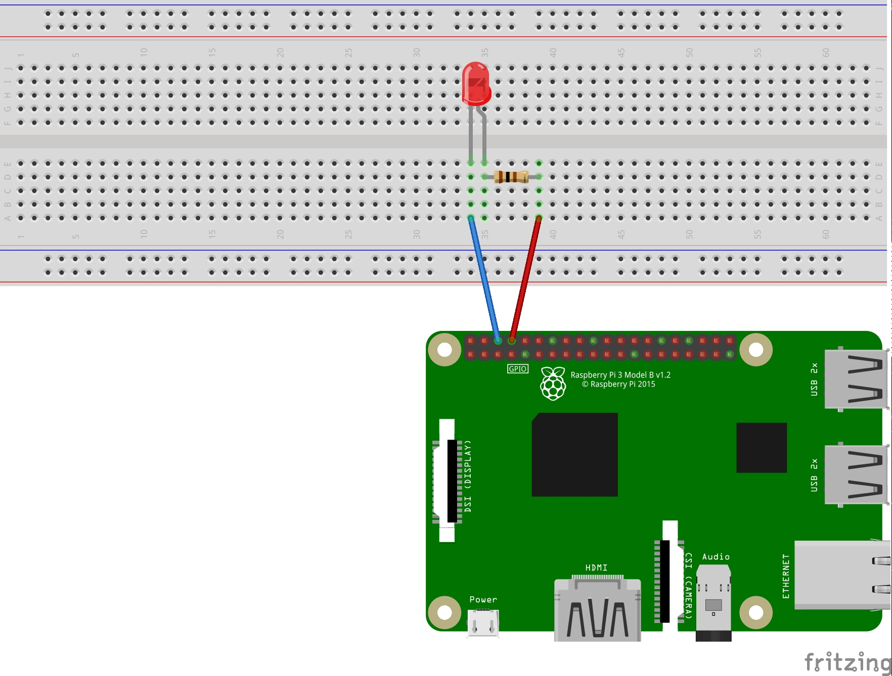

# Getting Started with Raspberry Pi v0.2

---

# What is it?

---

# What is it?

- small computer that can run linux
- **many** distros available. we will use vanilla Rasbian Lite (No gui)
- other OSes available: RISC OS, Windows IoT
- lots of interfaces

---

# ¡¡¡Its just a computer!!!

---

# Whats it for?

- education and research
- some commercial projects e.g. Pro-ject stream box
- ❌ IoT device (depends on usage)
- ✅ edge device (depends on usage)

---

# Lets Go

---

# Tasks part 1

- flash SD card
- set up wifi
- enable ssh
- change hostname

---

# Tasks part 2

- change default password
- setup key based auth
- wire up blinky circuit
- program blinky
- run blinky.py on boot
- deploy script
- profit

---

# Flash SD card 1

- `https://www.raspberrypi.org/downloads/raspbian/`
- download and unzip image
- insert sd card

---

# Flash SD card 2

- get disk id: `diskutil list`
- unmount drive: `diskutil unmountDisk /dev/DISK_ID`
- `sudo dd bs=1m if=PATH_TO_YOUR_IMG of=/dev/rYOUR_DISK conv=sync`
- ⚠️ double check your are writing to the correct disk ⚠️ 

---

# /dev/disk vs /dev/rdisk

>In layman's terms `/dev/rdisk` goes almost directly to disk and `/dev/disk` goes via a longer more expensive route

---

# Set up WiFi

- insert card into computer

```
    touch /Volumes/boot/wpa_supplicant.conf
```
- open in yr favourite text editor
- paste contents of code from dino

---

# Enable ssh

```
    touch /Volumes/boot/ssh
```
- eject card from computer

---

# Change hostname 1

- ⚠️ if there are more than one of you on the same wifi this one at a time because zeroconf ⚠️
- insert card into pi
- power it up
- `ssh pi@raspberrypi.local`
- password: **raspberry**

---

# Change hostname 2
- `sudo nano /etc/hostname`
- change the hostname to something unique
- reboot: `sudo reboot now`

---

From here, many pis will be accessible on the same network 

---

# Change default password
- `passwd`

---

# Set up key based auth

- **on your mac**
- `ls ~/.ssh`
- `ssh-copy-id -i ~/.ssh/MY_PUBLIC_KEY pi@PI_HOSTNAME.local`
- `https://www.raspberrypi.org/documentation/remote-access/ssh/passwordless.md`

---

# Wire up blinky circuit


---

# Install .py GPIO libs

- `sudo apt-get install python-rpi.gpio python3-rpi.gpio`
- install other software now if you need/want it

---

# Program blinky.py 1

- create and open `~/blinky.py`
- type or copy paste code

```python
import RPi.GPIO as GPIO # Import Raspberry Pi GPIO library
from time import sleep # Import the sleep function from the time module

GPIO.setwarnings(False) # Ignore warning for now
GPIO.setmode(GPIO.BOARD) # Use physical pin numbering
GPIO.setup(8, GPIO.OUT, initial=GPIO.LOW) # Set pin 8 to be an output pin and set initial value to low (off)

while True: # Run forever
    GPIO.output(8, GPIO.HIGH) # Turn on
    sleep(1) # Sleep for 1 second
    GPIO.output(8, GPIO.LOW) # Turn off
    sleep(1) # Sleep for 1 second
```
- save file

---

# Run blinky.py

`python blinky.py`

---

# Run at startup

- open `sudo nano /etc/rc.local`

- paste this `sudo python /home/pi/blinky.py & > /home/pi/log.txt 2>&1` in before `exit`

---

# Deploy script 1

- create `~/deploy.sh`
- type or copy & paste

```shell
#! /bin/bash

echo "copying files"
scp -r blinky.py pi@PI_HOSTNAME.local:/home/pi/blinky.py
echo "done"
```
- save

---

# Deploy script 2

- make it executable 
- `chmod 744 deploy.sh`
- make a change to `blinky.py` to test
- run `sh deploy.sh`

---

# 🦄 Mai Linh 🦄


https://gist.github.com/MaiLinhGroup

---

# These slides

https://github.com/genericspecific/pi_workshop
